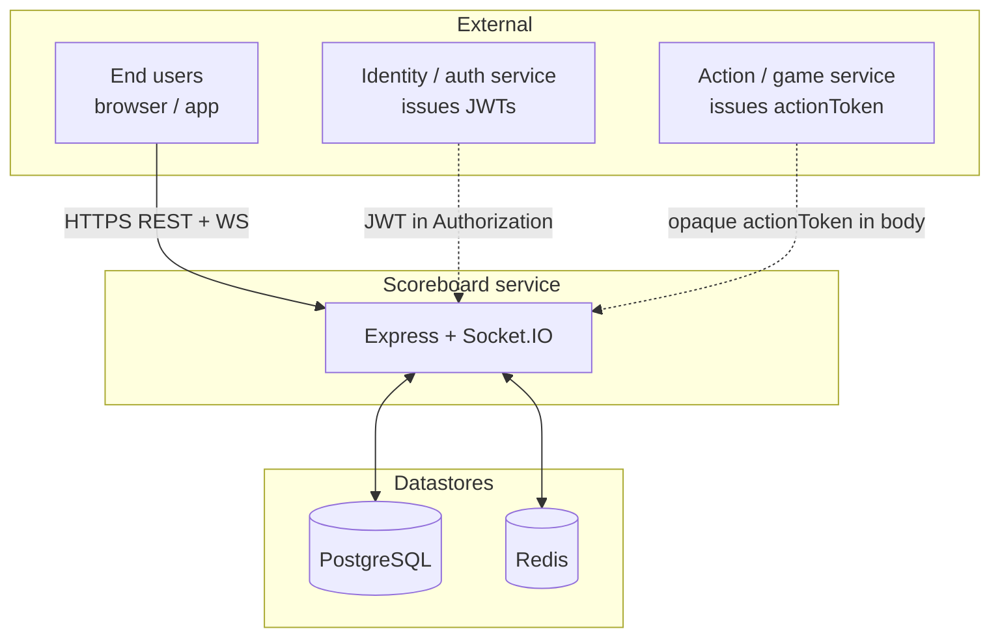
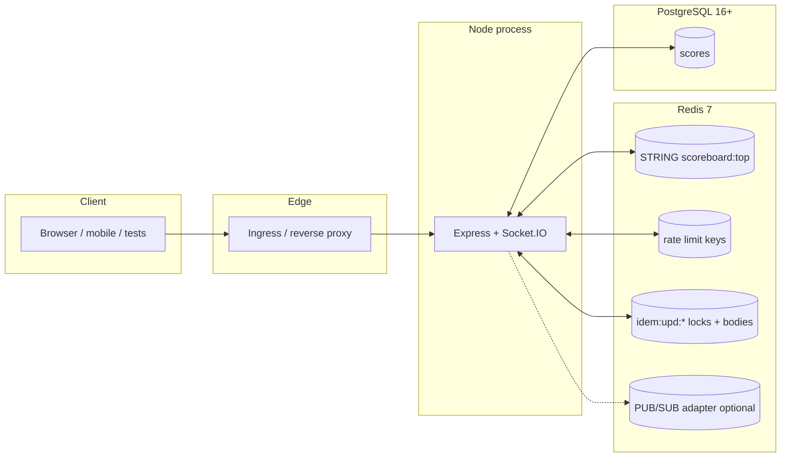
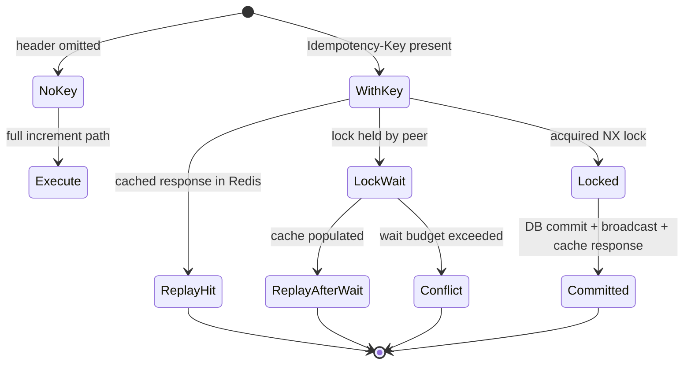
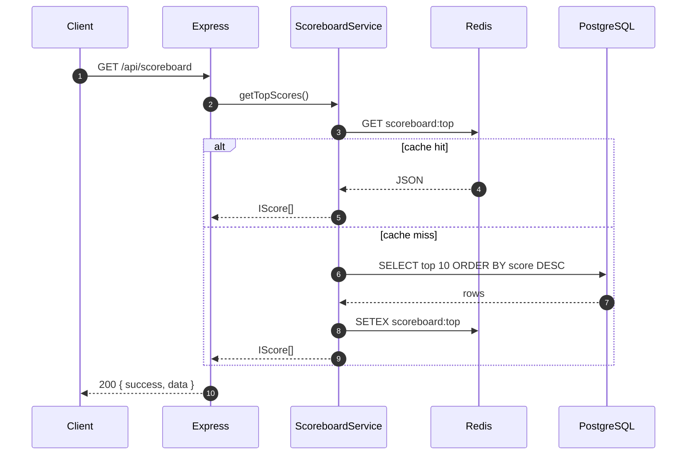
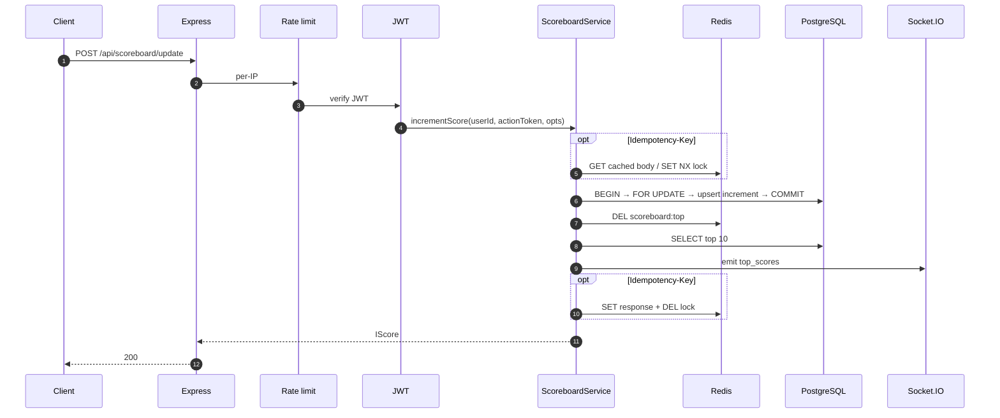
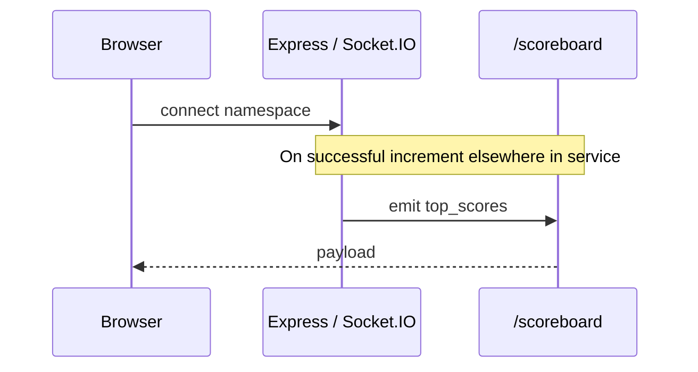

# Architecture — Scoreboard service (Problem 6)

**Service name:** `problem6-scoreboard` (package: `problem6-scoreboard-service`)  
**Stack:** Node.js 20+, TypeScript, Express, PostgreSQL, Redis, Socket.IO  
**Audience:** engineers owning design reviews, on-call, security questionnaires, and production hardening.

This document is **specific to the code in `src/problem6/`**. It is not a generic template and not a copy of another repository’s layout; it states what exists today, what we assume at the boundary, and what we recommend next.

---

## Document map

| Section | What you get |
| ------- | -------------- |
| [1. Purpose and scope](#1-purpose-and-scope) | Problem statement, in-scope / out-of-scope |
| [2. Architectural principles](#2-architectural-principles) | Non-negotiable design choices |
| [3. System context](#3-system-context) | Who talks to whom (C4-style context) |
| [4. Containers and deployment](#4-containers-and-deployment) | Processes, ports, scaling knobs |
| [5. Logical architecture](#5-logical-architecture) | Layers, modules, dependency rule |
| [6. Runtime behaviour](#6-runtime-behaviour) | Boot sequence, request middleware order |
| [7. Data architecture](#7-data-architecture) | Schema, consistency, cache-aside, Redis key families |
| [8. API and contracts](#8-api-and-contracts) | REST, WebSocket events, status codes |
| [9. Security architecture](#9-security-architecture) | Trust boundaries, JWT, rate limits, CORS, secrets |
| [10. Reliability and failure handling](#10-reliability-and-failure-handling) | Failure matrix, idempotency |
| [11. Performance and scalability](#11-performance-and-scalability) | Hot paths, limits, horizontal scale |
| [12. Configuration](#12-configuration) | Environment variables and tuning constants |
| [13. Observability](#13-observability) | Datadog, health endpoints, logging |
| [14. Quality and testing](#14-quality-and-testing) | Test pyramid, CI gates |
| [15. Delivery and operations](#15-delivery-and-operations) | CI/CD, Docker, runbook notes |
| [16. Risks, constraints, roadmap](#16-risks-constraints-roadmap) | Debt and evolution |

Diagrams use [Mermaid](https://mermaid.js.org/).

---

## 1. Purpose and scope

### 1.1 Problem

Expose a **public read** of the **top 10** scores (ordered descending) and allow **authenticated users** to **increment** their score when they present a valid **JWT** and an **action token** (opaque string today; cryptographically verifiable in backlog). After each successful write, **connected clients** receive an updated leaderboard via **Socket.IO**.

### 1.2 In scope

- HTTP JSON API on a single `PORT`.
- Socket.IO on the **same** HTTP server (upgrade on same port).
- PostgreSQL as **system of record** for scores.
- Redis for **leaderboard cache**, **rate limiting**, **optional idempotency** storage, and **optional** Socket.IO multi-instance adapter.
- Structured logging, liveness/readiness endpoints, Datadog-oriented observability guidance.

### 1.3 Out of scope (by design today)

- User registration, login, or token issuance (JWTs are verified only; issuer is external).
- Full cryptographic verification of `actionToken` (minimum length check only).
- Event bus, outbox, CQRS read models, or separate read replicas.
- Automated schema migrations in the application process (`src/sql/resources.sql` is applied out-of-band).

---

## 2. Architectural principles

1. **Single writer path for score changes** — all increments go through one service operation that uses a DB transaction and then invalidates cache and broadcasts.
2. **Postgres is truth** — Redis leaderboard JSON is **cache-aside**; safe to drop; rebuild from DB on miss.
3. **Defence in depth at the edge of the service** — rate limits and JWT checks before expensive work.
4. **Explicit operational endpoints** — separate **liveness** (`/live`, `/health`) from **readiness** (`/ready`) so orchestrators and monitors behave correctly.
5. **Observable by default** — `src/logger/logger.ts`: JSON lines in **production** for Datadog; **console** locally (`LOG_FORMAT` can override). Datadog `dd-trace` in `tracer.ts` (off unless `DD_TRACE_ENABLED=true`). See `monitoring/datadog.md` and `src/logger/README.md`.

---

## 3. System context

Actors and systems this service depends on or serves.

**Assumptions:** JWTs are **HS256** with a shared `JWT_SECRET` configured in this service (suitable for controlled environments; production often prefers JWKS / asymmetric keys from the issuer).

---

## 4. Containers and deployment

### 4.1 Logical containers

| Container / process | Responsibility |
| ------------------- | -------------- |
| **Node API** | HTTP + WebSocket; business logic; pool to Postgres; Redis client(s). |
| **PostgreSQL** | Persistent `scores` table. |
| **Redis** | Cache, rate counters, idempotency keys, optional Socket.IO adapter pub/sub. |

Local full stack: `docker-compose.yml` in `problem6/` (API + Postgres + Redis). Shared infra only: repo-root `docker-compose.problems-456.yml` (databases only; API on host).

### 4.2 Network and ports (typical dev)

| Exposure | Default |
| -------- | ------- |
| API HTTP + Socket.IO | `PORT` (e.g. 8002) |
| Postgres (host-mapped in compose) | often 5433 |
| Redis | 6379 |

Production: terminate TLS at **ingress**; do not expose Postgres/Redis publicly.

### 4.3 Horizontal scaling

| Concern | Mechanism |
| ------- | --------- |
| REST | Stateless; scale replicas behind LB. |
| Socket.IO multi-node | Set `SOCKET_IO_REDIS_ADAPTER=true`; requires Redis and duplicate connections for pub/sub adapter. |
| Sticky sessions | Recommended when mixing WS and instance-local assumptions; broadcast path is global when adapter is on. |

---

## 5. Logical architecture

### 5.1 Layering

| Layer | Path pattern | Responsibility |
| ----- | ------------ | -------------- |
| **Routes** | `src/routes/` | Compose middleware chains; mount `/api` and system routes. |
| **Middlewares** | `src/middlewares/` | Rate limit, JWT, Zod validation, error envelope. |
| **Controllers** | `src/controllers/` | Map HTTP ↔ service calls; no business rules. |
| **Service** | `src/service/` | Orchestration: token check, transactions, cache invalidation, gateway broadcast. |
| **Repository** | `src/repository/` | SQL only (`pg`), parameterised queries. |
| **Redis helpers** | `src/redis/` | Cache read/write/invalidate for leaderboard JSON. |
| **Gateway** | `src/gateway/` | Socket.IO server and namespace; emit events after writes. |
| **Config** | `src/config/` | Env, DB pool, Redis singleton, constants. |
| **Cross-cutting** | `src/logger/`, errors | Console vs JSON logs, Datadog tracer bootstrap |

**Dependency rule:** outer layers call inward; `repository` and `redis` do not import `controllers` or `routes`.

### 5.2 System topology (internal)

---

## 6. Runtime behaviour

### 6.1 Bootstrap (`src/main.ts`)

1. **`import '@/logger/tracer'`** — loads `dotenv`, initialises **`dd-trace`** (APM off unless `DD_TRACE_ENABLED=true`). Must stay the **first** import so Express / `pg` / `ioredis` are patched when tracing is on.
2. Create Express app + HTTP server.
3. Register routes (system routes first: `/live`, `/health`, `/ready`; then `/api/*`).
4. Initialise Redis client and **ping** (fail fast if Redis unreachable).
5. Initialise Socket.IO on the HTTP server (optional Redis adapter).
6. Listen on `PORT`.

`src/config/env.ts` also calls `dotenv.config()`; a second load is harmless.

### 6.2 Middleware order for `POST /api/scoreboard/update`

1. **Per-IP rate limit** (Redis fixed window).
2. **JWT** — extract `sub` as user id; reject if missing/invalid.
3. **Per-subject rate limit** (Redis, keyed by JWT `sub`).
4. **Body validation** (Zod strict schema: `actionToken`).
5. **Controller** → **Service** → transaction + side effects.

`GET /api/scoreboard` is public (no JWT).

---

## 7. Data architecture

### 7.1 Relational model

Table **`scores`** (see `src/sql/resources.sql`):

| Column | Role |
| ------ | ---- |
| `id` | UUID primary key. |
| `user_id` | **Unique** business key (one row per user). |
| `score` | Monotonic increment target (bigint). |
| `version` | Optimistic concurrency column (incremented with updates where applicable). |
| `created_at` / `updated_at` | Audit timestamps. |

Index **`idx_scores_score_desc`** supports efficient “top N by score” reads.

### 7.2 Write path consistency

- Increment runs inside **`withTransaction`**: `SELECT … FOR UPDATE` on the user row, then **upsert** / increment logic in repository.
- After commit: **delete** leaderboard cache key, **re-read** top 10 from Postgres for broadcast payload (cold read ensures clients see DB-consistent slice).

### 7.3 Cache-aside (Redis)

| Key / pattern | Purpose | TTL / lifetime |
| ------------- | ------- | -------------- |
| `scoreboard:top` (from `CACHE_KEY_TOP_SCORES`) | JSON array of top scores | `CACHE_TTL_SECONDS` (5) on set after miss |
| Rate limit keys | `INCR` windows | window-bound |
| `idem:upd:res:{user}:{key}` | Cached successful response body | `IDEMPOTENCY_TTL_SECONDS` (24h) |
| `idem:upd:lock:{user}:{key}` | In-flight lock | `IDEMPOTENCY_LOCK_SECONDS` (30) |

**Invariant:** losing Redis must not corrupt Postgres; worst case is higher DB load and loss of rate limit / idempotency until Redis returns.

---

## 8. API and contracts

### 8.1 REST summary

| Method | Path | Auth | Description |
| ------ | ---- | ---- | ----------- |
| GET | `/live`, `/health` | None | Liveness. |
| GET | `/ready` | None | Readiness (Postgres + Redis). |
| GET | `/api/scoreboard` | None | Top `TOP_SCORES_LIMIT` (10) scores, cache-aside. |
| POST | `/api/scoreboard/update` | Bearer JWT | Body `{ "actionToken": string }`; optional header `Idempotency-Key`. |

### 8.2 Socket.IO

| Namespace | Event | Payload |
| --------- | ----- | ------- |
| `/scoreboard` (`WS_NAMESPACE`) | `top_scores` (`WS_EVENT_TOP_SCORES`) | Same shape as `GET /api/scoreboard` → `data` (array of score objects). |

Clients: **`socket.io-client`** only; CORS via `SOCKET_CORS_ORIGIN`.

### 8.3 Representative HTTP statuses

| Code | Typical cause |
| ---- | ------------- |
| 200 | Success. |
| 400 | Validation / invalid `actionToken`. |
| 401 | JWT missing or invalid. |
| 409 | Idempotency lock wait exhausted. |
| 429 | Rate limit (IP or `sub`). |
| 503 | `/ready` when dependencies down; 5xx on unhandled errors during requests. |

---

## 9. Security architecture

### 9.1 Trust boundaries

- **Untrusted:** all HTTP/WebSocket input from the internet.
- **Semi-trusted:** JWT if signed by a partner issuer you configure (`JWT_SECRET` must match issuer).
- **Trusted:** Postgres and Redis **inside** the private network only.

### 9.2 Controls implemented

| Control | Implementation |
| ------- | -------------- |
| Authentication | HS256 JWT on update route; `sub` identifies user. |
| Authorisation | Score change applies only to **caller’s** `sub` (no cross-user update in API). |
| Abuse mitigation | Redis-backed per-IP and per-`sub` rate limits (`RATE_LIMIT_*`). |
| Input validation | Zod `.strict()` DTOs; idempotency key format + length rules. |
| Transport | **TLS at ingress** in production (not enforced in app code). |
| CORS | `SOCKET_CORS_ORIGIN` — never `*` in production for real user browsers. |

### 9.3 Secrets and configuration

| Secret / sensitive config | Storage |
| ------------------------- | ------- |
| `JWT_SECRET` | Secret manager / K8s Secret; rotate with dual-secret window if you change approach. |
| `DB_*`, `REDIS_PASSWORD` | Same; not committed. |

### 9.4 Hardening backlog (security)

- Replace shared-secret JWT verification with **JWKS** or introspection if issuer supports it.
- **HMAC or signed** `actionToken` with dedicated verifier key; **replay table** (`SETNX` consumed token id) with TTL aligned to token lifetime.

---

## 10. Reliability and failure handling

### 10.1 Failure matrix

| Failure | User/system impact | Mitigation |
| ------- | ------------------- | ---------- |
| Redis down at boot | Process exits | Fix Redis; restart pod |
| Redis down mid-request | 5xx on routes using Redis | Retry with backoff; circuit breaker at client/LB |
| Postgres down | Writes/reads fail; `/ready` 503 | LB stops traffic; restore DB |
| Single replica crash | Brief outage | Multi-replica + health checks |
| Partial failure after DB commit | Rare stale cache if invalidation skipped | TTL on cache; ops can `DEL scoreboard:top` |
| Duplicate parallel updates with same idempotency key | Lock + wait; possible **409** | Client backs off and retries GET or POST |

### 10.2 Idempotency (optional `Idempotency-Key` header)

State machine (conceptual):

---

## 11. Performance and scalability

### 11.1 Hot paths

- **Read:** O(1) Redis GET on cache hit; else one indexed SQL query + Redis SETEX.
- **Write:** One transaction (row lock + upsert), cache delete, one top-10 SELECT, Socket.IO emit.

### 11.2 Constants (tuning)

Defined in `src/config/const.ts`:

| Constant | Value | Role |
| -------- | ----- | ---- |
| `TOP_SCORES_LIMIT` | 10 | Leaderboard size. |
| `SCORE_INCREMENT` | 1 | Step per successful update (repository/service). |
| `ACTION_TOKEN_MIN_LEN` | 10 | Minimum opaque token length. |
| `CACHE_TTL_SECONDS` | 5 | Leaderboard cache TTL. |
| `IDEMPOTENCY_*` | various | Lock wait, TTL, key max length. |

### 11.3 Backpressure

Rate limits cap abuse; DB pool size and `connectionTimeoutMillis` in `database.ts` bound DB pressure. For very high write QPS, next steps would be sharding, write coalescing, or async fan-out (out of current scope).

---

## 12. Configuration

Primary reference: **`.env.example`** and `src/config/env.ts`.

| Area | Variables |
| ---- | --------- |
| Server | `PORT` |
| Postgres | `DB_HOST`, `DB_PORT`, `DB_USER`, `DB_PASSWORD`, `DB_NAME` |
| Redis | `REDIS_HOST`, `REDIS_PORT`, `REDIS_PASSWORD` |
| Auth | `JWT_SECRET` |
| Socket.IO | `SOCKET_CORS_ORIGIN`, `SOCKET_IO_REDIS_ADAPTER` |
| Rate limit | `RATE_LIMIT_ENABLED`, `RATE_LIMIT_IP_MAX`, `RATE_LIMIT_SUB_MAX` |
| Logging | `NODE_ENV` (production → JSON for Datadog), `LOG_FORMAT` (`json` \| `console` override) |
| Datadog (optional) | `DD_ENV`, `DD_SERVICE`, `DD_VERSION`, `DD_AGENT_HOST`, … (see `monitoring/datadog.md`) |

---

## 13. Observability

### 13.1 Health endpoints

| Path | Semantics |
| ---- | --------- |
| `/live`, `/health` | Process alive; **no** dependency I/O. |
| `/ready` | Postgres `SELECT 1` + Redis `PING`; **503** if either fails. |

Kubernetes pattern: **liveness** → `/live`; **readiness** → `/ready`.

### 13.2 Logging

Production logs: **JSON** lines from `src/logger/logger.ts` on stdout → Datadog Log Management (see **`monitoring/datadog.md`**). Local dev defaults to **readable console**. APM: `src/logger/tracer.ts` (imported first from `main.ts`).

### 13.3 APM and monitors (Datadog)

- **`dd-trace`** is initialised in **`src/logger/tracer.ts`**, imported first from **`main.ts`** (`import '@/logger/tracer'`). Set `DD_TRACE_ENABLED=true` when an Agent is reachable. Extraction to a shared library is described in **`src/logger/README.md`**.
- **Synthetics / HTTP checks** on `/ready` from appropriate network vantage.
- **APM monitors** on error rate and p95 latency for `GET /api/scoreboard` and `POST /api/scoreboard/update`.

No Prometheus scrape endpoint in this service by design.

---

## 14. Quality and testing

| Layer | Tooling | Notes |
| ----- | ------- | ----- |
| Lint / format | ESLint, Prettier | `npm run check` |
| Unit | (minimal today) | Business logic largely in service; room for pure unit tests with mocked `pg`/Redis. |
| Integration | Vitest in `tests/` | Black-box: **requires running API** + Postgres + Redis; `tests/setup.ts` disables rate limits for stability. |

**CI:** **`src/problem6/workflows/problem6-ci.yml`** — Postgres + Redis service containers, schema apply, `npm run check`, `npm run build`, boot API, wait for `GET /ready`, `npm test`. GitHub only runs workflows from **`.github/workflows/`**; copy this file there if needed (see **`src/problem6/workflows/README.md`**).

---

## 15. Delivery and operations

### 15.1 CI/CD pipeline (summary)

1. Trigger on changes under `src/problem6/` (including `src/problem6/workflows/problem6-ci.yml`).
2. Install, lint, format check, compile TypeScript.
3. Start API with test `.env`; gate on `/ready`.
4. Run Vitest integration suite.

### 15.2 Artefacts

- **Dockerfile** — production image build path (`npm run build` + `node dist/main.js`).
- **Compose** — local orchestration with pinned DB images.

### 15.3 Operational runbook (short)

| Symptom | Check | Action |
| ------- | ----- | ------ |
| All instances 503 on `/ready` | Postgres/Redis health | Restore datastores; verify credentials |
| High 429 rate | `RATE_LIMIT_*` | Tune limits or fix abusive client |
| Stale leaderboard | Redis key `scoreboard:top` | `DEL` key or wait TTL; verify invalidation on write path |
| WS not updating multi-node | `SOCKET_IO_REDIS_ADAPTER` | Enable adapter; verify Redis reachability from all replicas |

---

## 16. Risks, constraints, roadmap

### 16.1 Risks

| Risk | Likelihood | Impact | Mitigation direction |
| ---- | ---------- | ------ | -------------------- |
| Weak `actionToken` validation | Medium | Fraudulent score bumps | HMAC + replay registry |
| Long-lived symmetric JWT secret | Medium | Token forgery if leaked | Short-lived tokens, JWKS, rotation |
| Redis SPOF for limits/cache | Medium | Degraded or down service | Redis HA; graceful degradation flags |

### 16.2 Constraints

- Single logical leaderboard (no multi-tenant partition key in schema).
- Schema applied **outside** the app (no embedded migrator).

### 16.3 Roadmap (engineering backlog)

| Item | Benefit |
| ---- | ------- |
| Versioned migrations (Atlas, Sqitch, `node-pg-migrate`) | Repeatable prod deploys |
| OpenTelemetry export to Datadog | Vendor-neutral traces + unified tail sampling |
| Contract tests / OpenAPI | Consumer safety and CI drift detection |
| Strong action token + idempotent action id | Security parity with high-trust game backends |

---

## Appendix A — Sequence diagrams

### A.1 Read top scores

### A.2 Score increment (with optional idempotency)

### A.3 Live updates

---

## Appendix B — Related files

| Document / path | Role |
| ---------------- | ---- |
| `README.md` | Setup, API examples, security table |
| `src/logger/README.md` | Observability module layout; extract to `npm i` shared package |
| `monitoring/datadog.md` | Datadog Agent, APM, logs, checks |
| `src/sql/resources.sql` | DDL |
| `src/problem6/workflows/problem6-ci.yml` | CI (copy to `.github/workflows/` for GitHub) |

---

*Version: aligned with repository tree at time of writing. Update this document when behaviour or boundaries change.*
