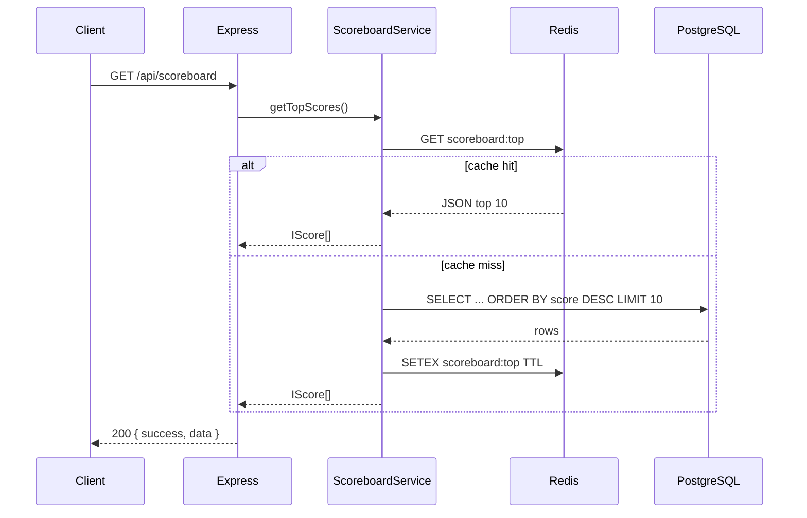
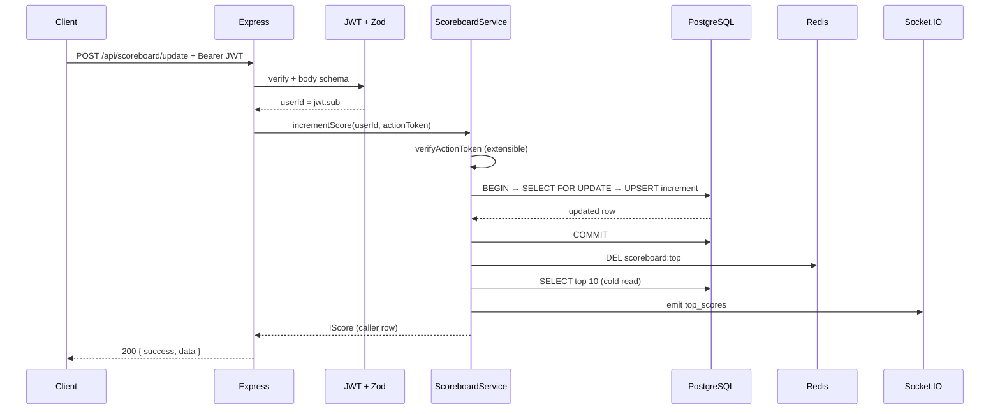

# Problem 6 — Live scoreboard service

Production-oriented backend for a **top-10 leaderboard** with **Redis cache**, **PostgreSQL** persistence, **JWT-authenticated** score increments, and **Socket.IO** push updates to connected browsers.

This README is written for **hand-off to a backend team** (per the architecture brief): it documents behaviour, runtime topology, security boundaries, and suggested hardening.

**Architecture (scope, security, data, reliability, ops, roadmap):** [ARCHITECTURE.md](./ARCHITECTURE.md) · **Datadog:** [monitoring/datadog.md](./monitoring/datadog.md)

---

## Requirements coverage


| Requirement   | Implementation                                                                                                                              |
| ------------- | ------------------------------------------------------------------------------------------------------------------------------------------- |
| Top 10 scores | `GET /api/scoreboard` — ordered by `score DESC`, limit 10 (`TOP_SCORES_LIMIT`)                                                              |
| Live updates  | After each successful increment, `broadcastTopScores()` emits on namespace `/scoreboard`, event `top_scores`                                |
| Action → API  | `POST /api/scoreboard/update` with `{ "actionToken": "..." }` (opaque token from the action service)                                        |
| Authorisation | **Bearer JWT** on update; `sub` identifies the user. **Action token** gate + optional **Idempotency-Key**; see *Backlog* for HMAC/replay. |


---

## Architecture

### Layering


| Layer           | Responsibility                                                                         |
| --------------- | -------------------------------------------------------------------------------------- |
| **Routes**      | Order: **IP rate limit** → JWT → **per-sub rate limit** → Zod validate → controller      |
| **Controllers** | HTTP in/out, no business rules                                                         |
| **Service**     | Orchestration: token check → DB transaction → cache invalidation → WebSocket broadcast |
| **Repository**  | Parameterised SQL only (`pg`)                                                          |
| **Redis**       | Hot read cache for leaderboard JSON                                                    |
| **Gateway**     | Socket.IO server attached to the same HTTP server as Express                           |


Imports use **`@/*` → `src/*`** (see `tsconfig.json`). **`main.ts` must import `@/logger/tracer` before Express** so Datadog APM can patch integrations. Use **`import { log } from '@/logger'`** — **console** (readable) locally by default; **JSON** lines when `NODE_ENV=production` for Datadog (override with **`LOG_FORMAT=json`** or **`console`**). Dev uses `tsconfig-paths/register`. Release build uses **`tsconfig.build.json`** + **`tsc-alias`** so `dist/` runs with plain `node`.

### Execution flow (read path)




### Execution flow (score increment)




---

## Setup (local development)

Follow the steps in order (same style as **Problem 5**).

### 1. Copy env file

```bash
cp .env.example .env
```

Edit `.env`: set **`DB_*`**, **`REDIS_*`**, and **`JWT_SECRET`** so they match your Postgres and Redis. Use **`PORT`** if you need something other than **8002**. See the **Configuration** section right after this one for every variable.

### 2. PostgreSQL — database and schema

1. Start **PostgreSQL** and create a database whose name matches **`DB_NAME`** in `.env` (the example uses `scoreboard`):

   ```sql
   CREATE DATABASE scoreboard;
   ```

2. Apply **`src/sql/resources.sql`** once against that database (Workbench, TablePlus, `psql`, etc.). Example using `psql` — use your real **host**, **port**, **user**, **password**, and **database name** from `.env` (notably **`DB_PORT`**; **host is not the port number**):

   ```bash
   export PGPASSWORD='<DB_PASSWORD from .env>'
   psql -h 127.0.0.1 -p 5433 -U postgres -d scoreboard -f src/sql/resources.sql
   ```

   If Postgres is running via **`docker compose` in this directory** (see the **Docker** section later in this README), you can apply the file from the host with:

   ```bash
   docker compose exec -T postgres psql -U postgres -d scoreboard < src/sql/resources.sql
   ```

3. The Node app **does not** run `src/sql/resources.sql` on startup.

### 3. Redis

Start **Redis** and align **`REDIS_HOST`** / **`REDIS_PORT`** (and **`REDIS_PASSWORD`** if used) with `.env`. Defaults in `.env.example` assume `localhost:6379`.

### 4. Install dependencies

```bash
npm install
```

### 5. Run the API

```bash
# Development (hot reload)
npm run dev

# Production
npm run build && npm start
```

The process listens on **`PORT`** from `.env` (default **8002**). **HTTP** and **Socket.IO** share that same TCP port (Socket.IO upgrades on the same server as Express).

**REST**

- Base URL: `http://localhost:<PORT>/api/...` (e.g. `GET /api/scoreboard`, `POST /api/scoreboard/update`)

**Health (orchestrators / Datadog checks)**

- `GET /live` and `GET /health` → `{ "status": "ok" }` (liveness; no dependency checks).
- `GET /ready` → `{ "status": "ok", "postgres": true, "redis": true }` when Postgres and Redis respond; **503** if either is down (use for readiness probes and Datadog HTTP/Synthetic tests).

Observability is **Datadog-only** (logs, APM, monitors). See [monitoring/datadog.md](./monitoring/datadog.md).

**Live updates (Socket.IO)**

The API uses **Socket.IO** on the **same `PORT`** as REST. When a score changes, the server broadcasts the latest top-10 list on namespace **`/scoreboard`**, event **`top_scores`** (same JSON array shape as **`GET /api/scoreboard`** → `data`).

**Try it:** start **`npm run dev`**, then open **`tests/scoreboard-socket-demo.html`** in your browser (from this project folder—double-click is fine). Leave the base URL as `http://127.0.0.1:8002` unless you changed **`PORT`**. Click **Connect**, then trigger an update (e.g. run **`npm test`**, or call **`POST /api/scoreboard/update`** yourself). You will see **`top_scores`** messages appear in the log as the live board changes.

**From your own app:** install **`socket.io-client`** and use `io('http://<host>:<PORT>/scoreboard')` plus `socket.on('top_scores', ...)`. Do **not** use a bare `ws://…/scoreboard` URL in the browser’s generic WebSocket tab—that path is not a plain WebSocket endpoint.

**Browsers:** set **`SOCKET_CORS_ORIGIN`** in `.env` so your page’s origin is allowed (use `*` in local dev; see **Configuration**).

### Lint and format

- **`npm run check`** — ESLint + Prettier `--check`
- **`npm run format`** — Prettier (write)

### Tests (black-box, `tests/` only)

Vitest calls a **running** API (`fetch` + `socket.io-client`); it does **not** import `src/`. With Postgres, Redis, and **`npm run dev`** running:

```bash
npm test
# optional: PROBLEM6_BASE_URL=http://127.0.0.1:8002 npm test
```

`tests/setup.ts` sets `RATE_LIMIT_ENABLED=false` for Vitest so limits do not flake the suite.

---

## Configuration

Copy **`.env.example`** → **`.env`** if you have not already (see **Setup → 1**).


| Variable             | Purpose                                                       |
| -------------------- | ------------------------------------------------------------- |
| `PORT`               | HTTP + Socket.IO (default **8002**)                           |
| `NODE_ENV`           | Set to **`production`** in real deploys for JSON logs (Datadog); local dev usually unset or `development` → readable console |
| `LOG_FORMAT`         | Optional: **`json`** (always JSON) or **`console`** (always readable); overrides the `NODE_ENV` default |
| `DB_*`               | PostgreSQL connection                                         |
| `REDIS_*`            | Redis connection                                              |
| `JWT_SECRET`         | Verifies HS256 bearer tokens on `POST /api/scoreboard/update` |
| `SOCKET_CORS_ORIGIN` | `*` or comma-separated allowed origins for Socket.IO          |
| `SOCKET_IO_REDIS_ADAPTER` | `true` / `false` — `@socket.io/redis-adapter` for horizontal WS (default **false**) |
| `RATE_LIMIT_ENABLED` | `true` / `false` — Redis window limits on `POST /scoreboard/update` (default **true**; Vitest forces `false`) |
| `RATE_LIMIT_IP_MAX` | Max hits per client IP per ~60s on that route (default **300**) |
| `RATE_LIMIT_SUB_MAX` | Max updates per JWT `sub` per ~60s (default **60**) |


### Database schema

DDL lives in **`src/sql/resources.sql`**. Apply it once as described in **Setup → 2. PostgreSQL**; the application **does not** run this file on startup.

---

## Docker (Postgres + Redis + API)

From this directory:

```bash
export JWT_SECRET='a-long-random-string-for-compose'
docker compose up --build -d
```

- Postgres on host port **5433** (init runs `src/sql/resources.sql` on first volume create).
- API: `http://localhost:8002`

---

## API reference

### `GET /live` · `GET /health`

Return `{ "status": "ok" }` (liveness).

### `GET /ready`

Returns **200** `{ "status": "ok", "postgres": true, "redis": true }` when dependencies respond, or **503** `{ "status": "not_ready" }` otherwise. Use for readiness and Datadog HTTP checks.

### `GET /api/scoreboard`

Public. Returns top scores (cached when possible).

```json
{
  "success": true,
  "data": [
    {
      "id": "...",
      "userId": "opaque-user-id",
      "score": 42,
      "version": 3,
      "createdAt": "...",
      "updatedAt": "..."
    }
  ]
}
```

### `POST /api/scoreboard/update`

**Authorization:** `Bearer <JWT>` — body must include `sub` (subject / user id).

**Body (strict JSON — unknown keys rejected):**

```json
{ "actionToken": "opaque-proof-from-action-service" }
```

- **401** — missing/invalid JWT  
- **400** — validation / invalid `actionToken` / invalid `Idempotency-Key`  
- **409** — idempotency lock wait timeout (rare under parallel duplicate keys)  
- **429** — Redis rate limit (per IP or per `sub`)  
- **200** — returns the caller’s updated score row inside `{ success, data }`

**Optional header:** `Idempotency-Key` is sent as an HTTP header so body validation stays limited to `actionToken`, while the key behaves like normal cross-cutting metadata. Allowed characters match `[\w.-]+` (letters, digits, underscore, hyphen, dot), up to 128 characters. If omitted, no idempotency is applied. For a given user and key, a successful response is cached in Redis for **24 hours**; duplicate requests within that window receive the same stored body and do not increment the score again. See `IDEMPOTENCY_*` in `src/config/const.ts`.

---

## Security model (current vs target)


| Concern             | Current                             | Recommended next step                                                                                    |
| ------------------- | ----------------------------------- | -------------------------------------------------------------------------------------------------------- |
| User identity       | JWT `sub`                           | Short-lived access tokens; optional refresh flow                                                         |
| Action authenticity | Minimum token length                | **HMAC-SHA256** (or Ed25519) signed payload from the trusted action service; verify secret via KMS/Vault |
| Replay              | Not implemented                     | **Redis SETNX** `action:used:{jti}` with TTL ≥ action validity window                                    |
| Transport           | HTTP in dev                         | TLS everywhere in production; terminate at ingress                                                       |
| Socket CORS         | Configurable (`SOCKET_CORS_ORIGIN`) | Never `*` in production; explicit allowlist                                                              |


---

## Folder layout

```
src/
├── config/           # env, const, PostgreSQL pool, IORedis singleton
│   ├── env.ts
│   ├── const.ts
│   ├── database.ts   # Pool, execute(), withTransaction()
│   └── redis.ts      # Redis.init() for cache + rate limits + idempotency
├── controllers/
├── dto/              # Zod schemas (.strict())
├── errors/
├── gateway/          # Socket.IO
├── logger/           # Console (local) / JSON stdout (prod) + dd-trace (see logger/README.md)
│   ├── logger.ts
│   ├── tracer.ts
│   ├── index.ts
│   └── README.md     # Extract to npm package pattern
├── middlewares/
├── models/
├── redis/            # Domain cache helpers
├── repository/
├── routes/
├── sql/
│   └── resources.sql   # DDL — apply manually or via Docker init (same layout as problem5: `src/sql/`)
├── service/
├── utils/
│   ├── enum.ts       # ERROR — numeric HTTP status enum (same idea as problem5)
│   ├── asyncHandler.ts
│   └── helpers.ts
└── main.ts
monitoring/
└── datadog.md        # Datadog Agent, APM, logs, checks (no Prometheus)
tests/                # Vitest (HTTP + Socket.IO), `scoreboard-socket-demo.html` browser demo, no src imports
ARCHITECTURE.md       # Topology, sequences, failure modes, Datadog, CI/CD
```

---

## Production-oriented behavior

These capabilities are part of the codebase as shipped; configuration lives mainly in `src/config/const.ts` and env vars.

| Capability | How it works |
|------------|----------------|
| **Idempotency-Key** on `POST /api/scoreboard/update` | Optional HTTP header. Redis stores the first successful response per user+key for **24 hours** (`IDEMPOTENCY_TTL_SECONDS`); a short **NX lock** covers the in-flight update (`IDEMPOTENCY_LOCK_SECONDS`, wait/retry tuning via `IDEMPOTENCY_WAIT_*`). Constants are grouped as `IDEMPOTENCY_*` in `src/config/const.ts`. |
| **Rate limiting** (per client IP and per JWT `sub`) | Redis fixed-window counters (`INCR`); enable or tune with `RATE_LIMIT_ENABLED` and `RATE_LIMIT_*` (see environment table above). |
| **Structured logging** | `src/logger/logger.ts`: readable **console** locally; **JSON** stdout in production for Datadog (`LOG_FORMAT` overrides). |
| **Horizontal Socket.IO** (optional) | Set `SOCKET_IO_REDIS_ADAPTER=true` and use `@socket.io/redis-adapter` with Redis pub/sub. Docker Compose can turn this on for the `api` service when you run multiple instances. |

---

## Remaining backlog (larger programmes)

| Item | Notes |
|------|-------|
| **Datadog APM + monitors** | `dd-trace` (see `monitoring/datadog.md`), HTTP/Synthetic on `/ready`, log pipelines for JSON logger. |
| **Versioned DB migrations** | `node-pg-migrate`, Sqitch, or Atlas instead of a single DDL file. |
| **Cache / DB reconciliation** | Job or materialised view if denormalised cache diverges. |
| **Contract tests in CI** | Publish machine-readable API spec (e.g. OpenAPI) and validate with Dredd / Schemathesis when the surface stabilises. |
| **Action HMAC + replay** | Signed action payloads + `SETNX` consumed-token registry. |

